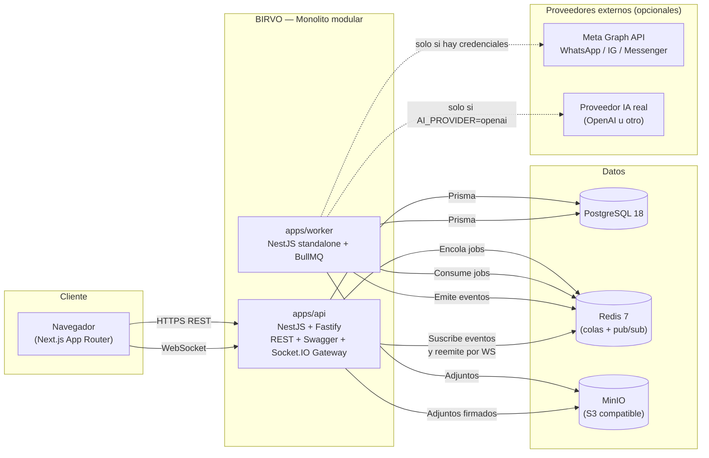
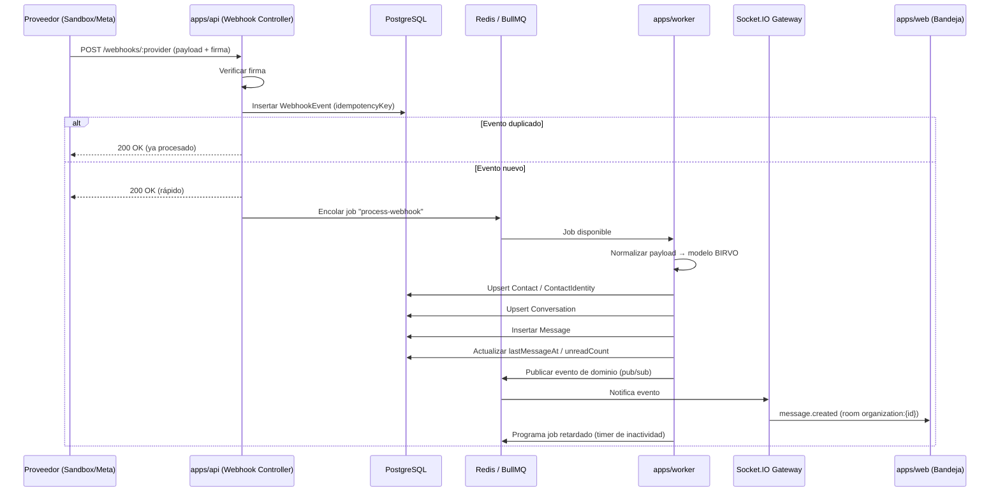
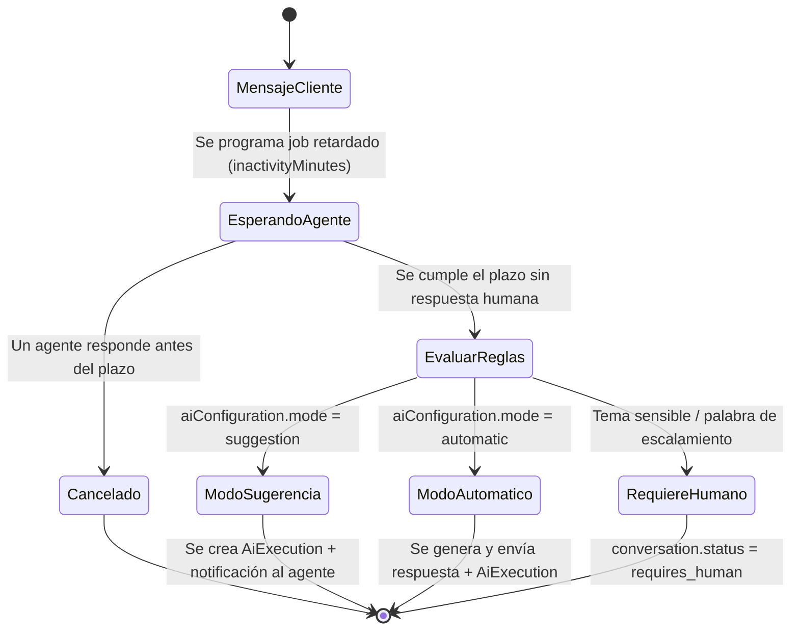

# BIRVO — Arquitectura general

> "Tus conversaciones. Un solo lugar."

## 1. Resumen

BIRVO es un **monolito modular** compuesto por tres aplicaciones independientes que comparten
paquetes internos (contratos, cliente de base de datos, SDKs de canal/IA, configuración y
logging). Se optó por monolito modular (no microservicios) porque:

- El equipo es pequeño y el dominio aún está en validación de producto.
- Los módulos de dominio (conversaciones, contactos, mensajes, automatizaciones) están
  fuertemente acoplados en el flujo transaccional de una bandeja omnicanal.
- Un monolito modular con límites de dominio claros (`apps/api/src/modules/*`) permite
  extraer servicios a futuro (p. ej. `ai-assistant` o `webhooks` como servicio independiente)
  sin reescritura, porque ya hay separación dominio/casos de uso/infraestructura.

## 2. Aplicaciones

| App | Responsabilidad | Stack |
|---|---|---|
| `apps/web` | Interfaz de usuario (bandeja, contactos, analítica, configuración) | Next.js 15 (App Router), Tailwind, shadcn/ui, TanStack Query, Zustand, Socket.IO Client |
| `apps/api` | API REST + WebSocket Gateway, autenticación, autorización, orquestación de dominio | NestJS 11 + Fastify, Prisma, Socket.IO |
| `apps/worker` | Procesamiento asíncrono: webhooks entrantes, envío de mensajes, temporizadores de inactividad, IA, transcripción | NestJS 11 (contexto standalone) + BullMQ + Redis |

Todas comparten:

- `packages/database` — esquema Prisma + cliente tipado + seeds.
- `packages/contracts` — esquemas Zod y tipos TypeScript compartidos entre API y Web (DTOs,
  eventos de socket, payloads normalizados de canal).
- `packages/channel-sdk` — interfaz `ChannelProviderAdapter` + adaptadores (`sandbox`, `meta`, `future`).
- `packages/ai-sdk` — interfaz `AiProvider` + `MockAiProvider` y adaptador real opcional.
- `packages/logger` — logger Pino configurado con correlation IDs.
- `packages/config` — carga y validación de variables de entorno (Zod) compartida por API/Worker.
- `packages/ui` — componentes shadcn/ui reutilizables y tokens de marca BIRVO.

## 3. Diagrama de contenedores

## 4. Flujo de mensaje entrante (webhook → bandeja en tiempo real)

## 5. Modelo operativo de IA — "humano primero, IA como respaldo"

## 6. Multi-tenant

- Toda entidad de negocio incluye `organizationId`.
- El `organizationId` **nunca** se acepta desde el cliente: se deriva siempre de la sesión
  autenticada (`request.session.organizationId`) en un `AuthGuard` + `TenantContext` que se
  inyecta en cada caso de uso. Los repositorios Prisma reciben el `organizationId` como
  parámetro obligatorio, nunca opcional.
- Los rooms de Socket.IO están particionados por organización
  (`organization:{organizationId}`) y se valida la pertenencia en el `handshake`.

## 7. Decisiones registradas

Ver `docs/adr/`. Resumen:

- ADR-0001: Monolito modular vs. microservicios.
- ADR-0002: NestJS + Fastify sobre Express.
- ADR-0003: Sesiones por cookie httpOnly firmadas (JWT) en vez de JWT en localStorage.
- ADR-0004: Arquitectura de canal desacoplada (`ChannelProviderAdapter`).
- ADR-0005: Modelo operativo de IA "humano primero".
- ADR-0006: Almacenamiento S3-compatible con adaptador local para desarrollo sin Docker.
- ADR-0007: Ejecución local en el entorno de construcción sin daemon Docker disponible.
